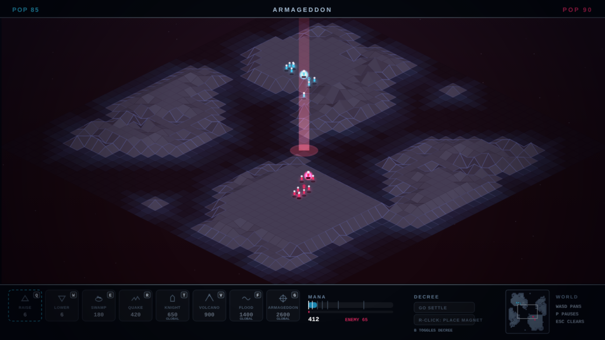

# NEOPOLIS

Sixth game in the harsh-critic-loop series, after
[NEONOID](https://github.com/melvincarvalho/neonoid),
[NEON MINER](https://github.com/melvincarvalho/neonminer),
[NEODROID](https://github.com/melvincarvalho/neodroid),
[NEON DASH](https://github.com/melvincarvalho/neondash) and
[NEONLINGS](https://github.com/melvincarvalho/neonlings). A Populous
tribute: an isometric world of deformable land where two gods contend
through their believers. Raise and lower the earth one vertex at a time,
grow settlements on the flat land you make, spend the mana of worship on
swamps, earthquakes, knights, volcanoes, floods — and, when the census
favors you, on armageddon. Original world and creatures — the real
Populous (Bullfrog, 1989) is copyrighted, and revered here.

**Play it: <https://melvincarvalho.github.io/neopolis/>**



**There are no assets.** Every pixel and every sound is generated from
code. Two files: `index.html`, `game.js`. Q/W raise and lower at the
cursor; E/R/T/V/F/G for the other powers; right-click plants the papal
magnet; B toggles the decree; WASD pans; the minimap pans on click.
Flood and armageddon demand a second confirming click.

```bash
python3 -m http.server 8000   # or just open index.html
```

## The experiment

Same pipeline as the first five games — one owner builds, deterministic
`?shot=` captures, four harsh sub-agent critics (three visual lenses plus
a Populous-fidelity judge), consensus fixes, re-score to plateau — with a
new species of proof. After NEONLINGS made levels theorems, NEOPOLIS has
no levels. **Gods are the theorems.**

`tools/playtest.sh` plays deterministic god-bot matches, headlessly,
every build:

- the **authored strategy** (plateau engineering + earlier aggression)
  must **WIN** its match against the stock AI — final run: won at t=559,
  having out-terraformed the enemy 469 deforms to 177; the trailing AI
  chose armageddon from a narrow census lead and lost the melee to the
  deeper economy;
- a god who **never acts must LOSE** (the wilderness barely supports
  life without terraforming — the canon thesis made literal);
- **ablate-flatten** (attack powers but no terraforming) must **LOSE** —
  the land is load-bearing;
- **ablate-powers** (terraforming but no attacks) must **LOSE** — the
  arsenal is the closer. In round 2 this ablation *won*, because the AI
  ended worlds it was losing; the fidelity critic caught that "the
  exploit had changed jerseys," the suicide clock was removed, and the
  theorem came out cleaner: economy necessary, powers decisive.

Plus **eight mechanism proofs**, each isolating one canon rule with the
policy layer stripped away: flat land grows settlements (level 5→8 when
an apron is flattened), deformation collapses them, the magnet commands
the faithful, the leader — not the mob — walks to the magnet while the
flock follows the leader, swamps persist and swallow, quakes shatter
towns, floods drown the lowlands, and walkers who meet merge their
strength. Every report carries populations, mana, power logs and
deformation counts, so every claim is auditable.

## Scores

| round | composition | game-feel | HUD | visual mean | Populous fidelity |
|---|---|---|---|---|---|
| 1 | 3.6 | 3.4 | 4.5 | **3.8** | 6.4 |
| 2 (final) | 4.4 | 4.6 | 6.0 | **5.0** | 7.6 |

Final-round verdicts: fidelity — *"the tribute finally has all eight
powers and a proper leader under the ankh."* HUD — *"the HUD grew up —
honest bars, real tooltips, a confirm gate."* Composition — *"real
carpentry happened — ziggurats, plinths, glyphs, coast falloff."* A large
post-panel fix batch (the AI's losing-side armageddon retired, per-team
strike flags, permanent volcano scars, paced armageddon collapse with a
ramping red wash, draw-path state mutations purged, monotonic window
glow, indigo neutral linework, verified end-screen staging — the capture
harness now refuses to emit a screenshot whose game-state claim is
false) was applied after the final scores; the numbers above are the
panel's, not post-fix.

## Honest assessment

- **The solution's win is inherited, not seized**: the stock AI casts
  armageddon from a legitimate narrow lead and loses the melee to the
  player-bot's deeper economy. The authored volcano-then-armageddon
  finisher exists and is gated honestly, but in the shipped match it
  never fires — the win card's own-hand armageddon comes from the
  staged match against an inert god. A meaner AI is the obvious next
  work.
- **One difficulty, one world layout law** (point-symmetric fairness),
  no campaign of worlds.
- **Walkers path naively** — they slide along coasts and cannot plan
  around water; armageddon armies march over the boiling sea by design
  (declared deviation — canon summoned the final battle to a plain).
- **No sliders**: canon's aggression/settlement sliders are reduced to
  two decrees (settle / to-the-magnet).
- Staged evidence shots are separate deterministic runs, not one
  continuous playthrough.

## Process notes

1. **The proof harness found the design's lies before any critic did.**
   Early builds stalemated forever: the census silently dropped walkers
   who merged or moved into houses, so both economies looked dead equal.
   Then flattening turned out to be *net-destructive* — the bots were
   collapsing their own towns by "fixing" adjacent vertices — which was
   only visible because doing nothing beat doing something in the
   telemetry. The fix (every vertex move must be provably non-harmful)
   is now a rule of the simulation itself.
2. **The wilderness had to be made hostile.** With naturally generous
   terrain, a passive god matched an active one and the central theorem
   of Populous — land is made, not found — was false in our own game.
   Roughening the world until unterraformed land barely supports life
   made null lose and the theorem true.
3. **The clock-edge was retired.** The first "solution edge" was a
   2.7× faster decision cadence — declared but hollow, since flattening
   proved target-bound, not speed-bound. It was replaced by an authored
   strategy (plateau engineering) that wins on the merits and is
   documented in code.

## License

Copyright © 2026 Melvin Carvalho.

Licensed under the [GNU Affero General Public License v3.0 or later](LICENSE)
(AGPL-3.0-or-later).
